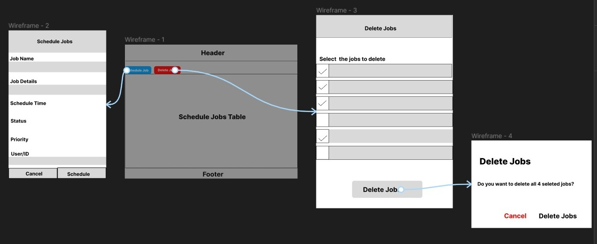

# Mockup Design for Action Button on Pulpito Website
I've created a mockup design for the action button on the Pulpito website that allows you to schedule and delete jobs. You can view and comment on the design in Figma by clicking on this link: [Action Button Mockup Design](https://www.figma.com/file/nmbnzFQf4oujhPFrsraO5P/Pulpito?node-id=0%3A1&t=UqOpMvhEXPuPE4bk-1).

I've also added a screenshot of the design to the file directory, which you can view below:

Mockup Screenshot

Please let me know if you have any feedback or suggestions. Thanks